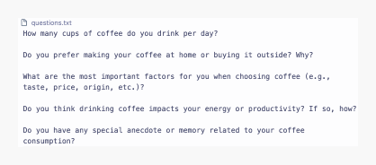
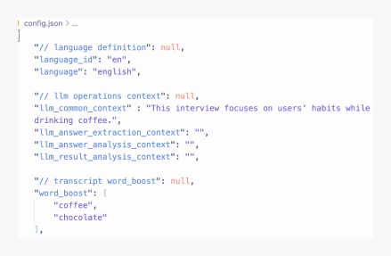
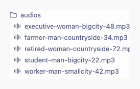
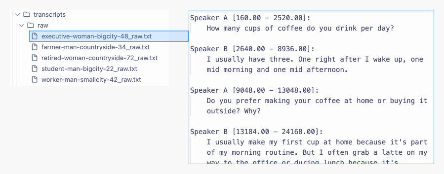
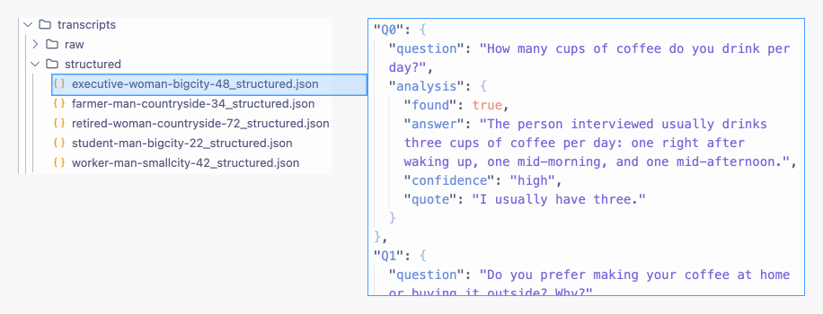
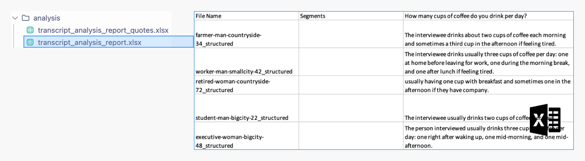
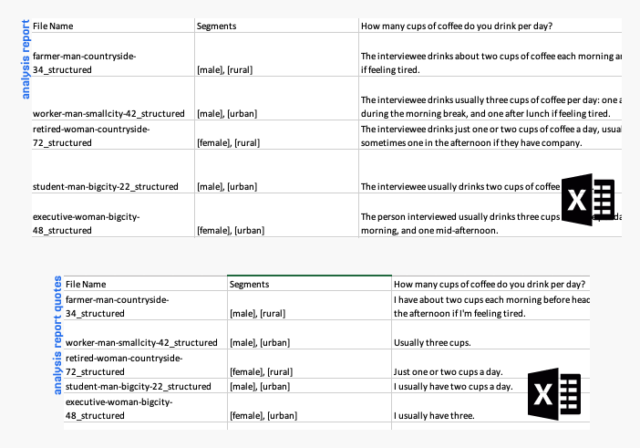
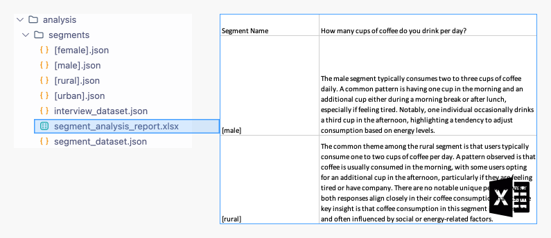
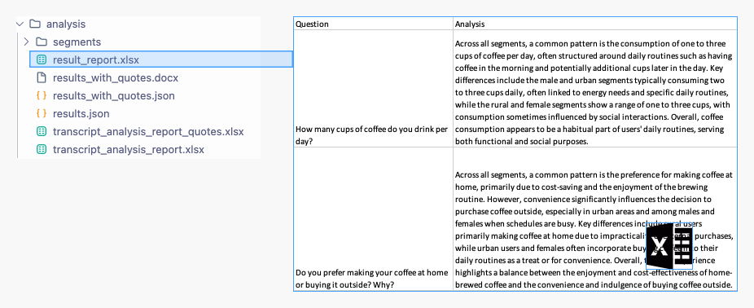

# user-research-helper
AI Assistant for UX Research: A human-in-the-loop helper for user interview transcription and insight analysis.


## Quick Start
1. `pip install -e .`
2. Copy `.envExample` to `.env` and set `OPENAI_API_KEY` and `ASSEMBLYAI_API_KEY`.
3. Prepare your `questions.txt`, `audios/` folder, and `config.json`.
4. Run `python process_transcripts.py your/project/folder`.
5. Edit `analysis/transcript_analysis_report.xlsx` to define segments.
6. Run `python process_analysis.py your/project/folder`.


## Introduction

User Research Helper is an AI-augmented tool that streamlines the process of analyzing user research interviews. It combines automated audio transcription (via AssemblyAI) with OpenAI-powered analysis to generate organized, question-based insights.

### Core Workflow

1. **Input**
   - Audio recordings of interviews
   - A set of predefined interview questions

2. **Process**
   - Transcribes each audio file automatically
   - Maps responses to corresponding interview questions
   - Provides an Excel report with initial analysis per question, per interview

3. **Human Review**
   - Lets you manually segment or categorize interviews in the Excel file
   - Offers the flexibility to refine automated analyses

4. **Output**
   - Generates a Word report that summarizes cross-interview findings by question
   - Integrates direct quotes from transcripts
   - Enables a high-level, human-vetted view of key insights

### Key Benefits

- **Save Time:** Automated transcription and analysis reduce manual overhead
- **Stay Flexible:** Human-in-the-loop oversight ensures you can refine results or override AI suggestions
- **Centralize Insights:** Organized Excel sheets and Word reports keep all findings in one place
- **Scalable:** Easily handle multiple interviews without losing structure or clarity

By blending automated data processing with manual oversight, User Research Helper allows UX researchers and analysts to focus on deeper insights, rather than tedious transcription and data wrangling.

 

## Features

**Automated Audio Transcription**
- Quickly convert interview recordings to text using the AssemblyAI API

**Question-Based Analysis**
- Automatically map interview responses to a predefined set of questions for organized insights

**Segment-Based Insights**
- Define user segments (e.g., demographics, behavior groups) and tag each interview's responses accordingly

**Excel Report Generation**
- Generate structured Excel files that summarize findings per question, per interview

**Quote Extraction**
- Automatically pinpoint and extract key quotes for easy reference in the analysis report

**Cross-Interview Insights**
- Combine data from multiple interviews to uncover broader trends, patterns, and outliers

**Multi-Language Support**
- Process interviews in various languages without sacrificing structure or clarity

## Prerequisites

- Python 3.9+
- Required API keys:
  - AssemblyAI API key (for transcription)
  - OpenAI API key (for analysis)

## Installation

1. Clone the repository
```bash
git clone https://github.com/nagoli/user-research-helper.git
cd user-research-helper
```

2. Install dependencies:
```bash
pip install -e .
```

3.	Set up Environment Variables
Copy the example environment file and fill in your personal API keys:
```bash
cp .envExample .env
```

Open the newly created .env file and update:
```bash
OPENAI_API_KEY=<your-openai-api-key>
ASSEMBLYAI_API_KEY=<your-assemblyai-api-key>
```


## Usage Guide

This **Usage** guide explains how to organize your data, run each processing step, and refine interview segments. It also describes the intermediate files that the tool generates to avoid unnecessary re-computation. If you ever need to re-run a specific analysis step, simply delete the relevant intermediate files before running the script again.

---

### 1. Data Setup

1. **Folder Structure**  
   Create or select a project folder with the following structure:

```
your/project/folder/
│
├── audios/         # Place your interview audio files here
├── config.json     # Configuration file for the analysis
└── questions.txt   # List of interview questions
```

2. **Use the `data_skeleton` Folder (Recommended)**  
- You can copy or reference the [`data_skeleton/` folder](data_skeleton/) included in this repository.  
- It contains a ready-to-use `config.json` that shows which settings you can define for your project—such as special instructions for the language model (LLM).  
- Feel free to customize `config.json` for flags like `"do_transcribe_audio": true/false` or other advanced settings related to LLM instructions.

3. **Required Files**  
- **`questions.txt`**: One interview question per line.  
- **`config.json`**: Stores project configuration (e.g., transcription toggle, advanced LLM parameters).  
- **`audios/`**: Folder containing your audio files to be transcribed.

> **Tip:** The [`demo/` folder](demo/) offers a complete walk-through with sample audio files, questions, and configuration. Use it as a reference to get started quickly.
> The demo includes a sample of 5 interviews exploring users’ habits while drinking coffee.  

> The question file for this demo project is:
> 

> The config file for this demo project is : 
> 

---

### 2. Process Transcripts

Once your data folder is prepared:

```bash
python process_transcripts.py your/project/folder
```

This script performs three main tasks and writes intermediate files to help avoid re-processing:

#### 1. Audio Transcription
- Reads `questions.txt` and transcribes every audio file in `audios/`
- Saves raw transcripts in `transcripts/raw/`

In the demo folder (5 sample audios), you'll see 5 raw transcripts:



#### 2. Structured Transcripts
- Organizes raw transcripts by your predefined questions
- Saves structured transcripts in `transcripts/structured/`

Example from demo: each transcript is now sectioned by question:



#### 3. Initial Analysis Reports
- Generates two Excel files in the `transcripts/` directory:
  - `transcript_analysis_report.xlsx`
  - `transcript_analysis_report_quotes.xlsx`
- These files list interview responses and notable quotes per question, per interview

The demo project example:



**Note on Intermediate Files**
- If you add a new interview (audio file) later, simply place it in `audios/` and rerun the script
- Existing transcripts are not overwritten unless you manually remove them. This design helps you avoid re-transcribing interviews every time.

### 3. Manual Segment Definition & Adjustment

After the initial analysis, the generated Excel files in the `transcripts/` folder will be automatically copied into the `analysis/` folder. These are the files you will modify to add segments or adjust AI-generated insights.

#### 1. Segments in the Analysis Folder
- Open `transcript_analysis_report.xlsx` located in the `analysis/` folder
- Under the Segment column, assign one or two segments (e.g., "Beginner", "Expert") to each interview. Separate multiple segments with commas
- Update or refine any AI-generated text if needed
- Repeat the same segment assignments in `transcript_analysis_report_quotes.xlsx` to keep quotes aligned

In the demo project, segments have been added to both files:



#### 2. Preserving Modifications
- The tool automatically generates fresh reports in the `transcripts/` folder if you re-run `process_transcripts.py`
- These new reports do not overwrite your `analysis/` folder files by default. This safeguard keeps your manual modifications safe
- If you want to incorporate newly generated data from `transcripts/` into `analysis/`, you'll need to manually overwrite the existing analysis files in `analysis/`—and re-add segments or edits as needed.

### 4. Process Analysis

Next, refine your insights further:
```bash
python process_analysis.py your/project/folder
```

This script uses intermediate files to avoid repeating costly computations:

#### 1. Segment-Based Analysis
- Reads your edited `transcript_analysis_report.xlsx` from `analysis/`
- Produces detailed, segment-focused Excel sheets in `analysis/segments/`

Demo shows segment analyses with key observations per group:


#### 2. Cross-Interview Insights
- Examines the segment-based output to identify patterns across multiple interviews
- Saves consolidated data in `analysis/results_report.xlsx`

Demo merges segment data to reveal broad trends:


#### 3. Comprehensive Word Report
- Combines quotes from `transcript_analysis_report_quotes.xlsx` with the aggregated data in `results_report.xlsx`
- Outputs a final `analysis_report.docx` in the `analysis/` folder

The demo project's final Word report looks like this:


### Regenerating Specific Parts

**Intermediate Files**
- Each stage above saves its results in distinct directories (e.g., `transcripts/raw`, `analysis/segments`).
- This design ensures you don’t need to re-run the entire workflow every time.

**How to Re-Run a Specific Step**
- Delete (or rename) the relevant intermediate files or folders. For instance, remove a specific raw transcript to re-transcribe an audio file.
- Then re-run the associated script (`process_transcripts.py` or `process_analysis.py`).
- The tool will regenerate only what’s missing, preventing unnecessary overhead.


By following these steps—while referencing the demo folder for concrete examples—you can flexibly manage, annotate, and analyze user interviews at scale. The human-in-the-loop model guarantees that AI-driven processes never overshadow your own expertise and insights.


## Project Structure

### Directories
- `src/` - Main source code directory
- `demo/` - Example project with sample files and configuration
- `data_skeleton/` - Template directory structure for new projects
- `assets/` - Documentation images and resources

## Dependencies

### Libraries
- `pandas` - For data processing
- `outlines` - For structured text processing
- `openai` - For AI-powered analysis
- `assemblyai` - For audio transcription
- `python-dotenv` - For environment variable management
- `transformers` - For text processing
- `openpyxl` - For Excel report generation
- `python-docx` - For Word document handling


## License

This project is licensed under the GNU General Public License v3.0 (GPL-3.0).

### What this means:

- You can freely use, modify, and distribute this software
- Any modifications or software including this code must also be released under the GPL-3.0
- You must disclose the source code when distributing the software
- Changes made to the code must be documented

For more details, see the [GNU GPL v3.0](https://www.gnu.org/licenses/gpl-3.0.en.html) license terms.

## Contributing

We welcome contributions from the community! If you're interested in improving User Research Helper, please feel free to fork the repository, make your changes, and submit a pull request. For major changes, please open an issue first to discuss what you would like to change. 


## Acknowledgments

This project was partially funded by [Access42](https://access42.net), a major supporter of web accessibility in France. We sincerely thank them for their support and trust in the development of this software.
